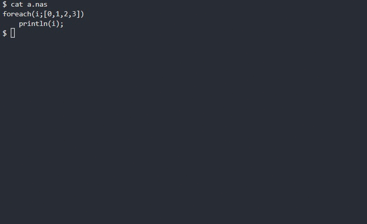
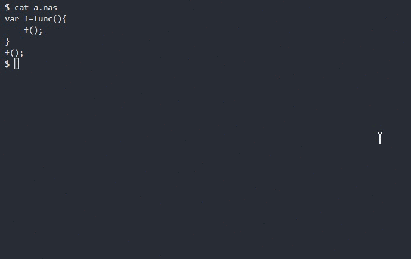

# __Nasal - Modern Interpreter__

</img>


[](../LICENSE)

> 这篇文档包含多语言版本: [__中文__](../doc/README_zh.md) | [__English__](../README.md)

## __目录__

* [__简介__](#简介)
* [__编译__](#编译)
* [__使用方法__](#使用方法)
* [__教程__](#教程)
* [__发行日志__](../doc/dev_zh.md#发行日志)
* [__开发历史__](../doc/dev_zh.md)
* [__测试数据__](../doc/benchmark.md)
* [__特殊之处__](#与andy解释器的不同之处)
* [__堆栈追踪信息__](#堆栈追踪信息)
* [__调试器__](#调试器)
* [__交互解释器__](#交互解释器)

__如果有好的意见或建议，欢迎联系我们!__

* __E-mail__: __lhk101lhk101@qq.com__

## __简介__

[Nasal](http://wiki.flightgear.org/Nasal_scripting_language)
是一款语法与ECMAscript相似的编程语言，并作为运行脚本被著名开源飞行模拟器 [FlightGear](https://www.flightgear.org/) 所使用。
该语言的设计者为 [Andy Ross](https://github.com/andyross)。

该解释器项目由 [ValKmjolnir](https://github.com/ValKmjolnir) 完全使用 `C++`(`-std=c++17`)重新实现，没有复用 [Andy Ross的nasal解释器](https://github.com/andyross/nasal) 中的任何一行代码。尽管没有参考任何代码，我们依然非常感谢Andy为我们带来了这样一个神奇且简洁的编程语言。

该项目使用 __MIT__ 协议开源 (2019/7 ~ 2021/5/4 ~ 2023/5)，从 2023/6 开始使用 __GPL v2__ 协议。

### __我们为什么想要重新写一个nasal解释器?__

2019年暑假，[FGPRC](https://www.fgprc.org.cn/) 的成员告诉我，在Flightgear中提供的nasal控制台窗口中进行调试很不方便，仅仅是想检查语法错误，也得花时间打开软件等待加载进去后进行调试。所以我就写了一个全新的解释器来帮助他们检查语法错误以及运行时错误。

我编写了nasal的词法分析器和语法分析器，以及一个全新的字节码虚拟机，并用这个运行时来进行nasal程序的调试。我们发现使用这个解释器来检测语法和运行时错误极大的提高了效率。

你也可以使用这个语言来写一些与Flightgear运行环境无关的有趣的程序，并用这个解释器来执行。你也可以让解释器来调用你自己编写的模块，使它成为项目中一个非常有用的工具。

## __编译__


我们推荐你下载最新代码包编译，这个项目非常小巧,没有使用任何第三方库，因此编译起来非常轻松，
你只需要这两样东西: C++ 编译器以及make程序。

__注意__: 如果你想直接下载发行版提供的zip/tar.gz压缩包来构建这个解释器，在下载之前请阅读[__发行日志__](../doc/dev_zh.md#发行日志)以保证这个发行版的文件中不包含非常严重的bug。

### __`Windows` 平台(`MinGW-w64`)__

一定要确保您的 MinGW thread model 是 `posix thread model`, 否则可能存在没有 thread 库的问题。

> mkdir build
>
> mingw32-make nasal.exe -j4

### __`Windows` 平台(`Vistual Studio`)__

项目提供了 [__CMakeLists.txt__](../CMakeLists.txt) 用于在`Visual Studio`中用这种方式来创建项目。

### __`Linux/macOS/Unix` 平台__

> mkdir build
>
> make -j4

你也可以通过如下的其中一行命令来指定你想要使用的编译器：

> make nasal CXX=...

## __使用方法__


如果你是 `Windows` 用户且想正常输出unicode，在nasal代码里写这个来开启unicode代码页:

```javascript
if(os.platform()=="windows")
    system("chcp 65001");
```

## __教程__

Nasal是非常容易上手的，你甚至可以在15分钟之内看完这里的基本教程并且直接开始编写你想要的程序。
__如果你先前已经是C/C++, javascript选手，那么几乎可以不用看这个教程……__ 在看完该教程之后，基本上你就完全掌握了这个语言:

<details><summary>基本类型</summary>

__`none`__ 是特殊的错误类型。这个类型用于终止虚拟机的执行，该类型只能由虚拟机在抛出错误时产生。

__`nil`__ 是空类型。类似于null。

```javascript
var spc=nil;
```

__`num`__ 有三种形式:十进制，十六进制以及八进制。并且该类型使用IEEE754标准的浮点数`double`格式来存储。

```javascript
# 该语言用 '#' 来作为注释的开头
var n=2.71828;    # dec 十进制
var n=2.147e16;   # dec 十进制
var n=1e-10;      # dec 十进制
var n=0xAA55;     # hex 十六进制
var n=0o170001;   # oct 八进制

# 注意: true 和 false 关键字在现在的 nasal 里也是可用的
var n=true;       # n 实际上是数字 1.0
var n=false;      # n 实际上是数字 0.0
```

__`str`__ 也有三种不同的格式。第三种只允许包含一个的字符。

```javascript
var s='str';
var s="another string";
var s=`c`;
# 该语言也支持一些特别的转义字符:
'\a'; '\b'; '\e'; '\f';
'\n'; '\r'; '\t'; '\v';
'\0'; '\\'; '\?'; '\'';
'\"';
```

__`vec`__ 有不受限制的长度并且可以存储所有类型的数据。(当然不能超过可分配内存空间的长度)

```javascript
var vec=[];
var vec=[0,nil,{},[],func(){return 0}];
append(vec,0,1,2);
```

__`hash`__ 使用哈希表 (类似于`python`中的`dict`)，通过键值对来存储数据。key可以是一个字符串，也可以是一个标识符。

```javascript
var hash={
    member1:nil,
    member2:"str",
    "member3":"member\'s name can also be a string constant",
    funct:func(){
        return me.member2~me.member3;
    }
};
```

__`func`__ 函数类型。(实际上在这个语言里函数是一种`lambda`表达式)

```javascript
var f=func(x,y,z){
    return nil;
}
# 函数声明可以没有参数列表以及 `(`, `)`
var f=func{
    return 114514;
}
var f=func(x,y,z,deft=1){
    return x+y+z+deft;
}
var f=func(args...){
    var sum=0;
    foreach(var i;args)
        sum+=i;
    return sum;
}
```

__`upval`__ 是存储闭包数据的特殊类型, 在 __`vm`__ 中使用，以确保闭包功能正常。

__`obj`__ 是用来存储`C/C++`的一些复杂数据结构。这种类型的数据由内置函数生成。如果想为nasal添加新的数据结构, 可以看下文如何通过修改本项目来添加内置函数。

</details>

<details><summary>运算符</summary>

Nasal拥有基本的四种数学运算符 `+` `-` `*` `/`以及一个特别的运算符 `~`，用于拼接字符串。

```javascript
1+2-(1+3)*(2+4)/(16-9);
"str1"~"str2";
```

对于条件语句，可以使用`==` `!=` `<` `>` `<=` `>=`来比较数据。`and` `or` 与C/C++中 `&&` `||`运算符一致。

```javascript
1+1 and (1<0 or 1>0);
1<=0 and 1>=0;
1==0 or 1!=0;
```

单目运算符`-` `!`与C/C++中的运算符功能类似。

```javascript
-1;
!0;
```

位运算符`~` `|` `&` `^`与C/C++中的运算符功能类似。

```javascript
# 运行过程:
# 1. 将 f64 强转为 i32 (static_cast<int32_t>)
# 2. 执行位运算符

~0x80000000; # 按位取反 2147483647
0x8|0x1;     # 按位或
0x1&0x2;     # 按位与
0x8^0x1;     # 按位异或
```

赋值运算符`=` `+=` `-=` `*=` `/=` `~=` `^=` `&=` `|=`正如其名，用于进行赋值。

```javascript
a=b=c=d=1;
a+=1;
a-=1;
a*=1;
a/=1;
a~="string";

a^=0xff;
a&=0xca;
a|=0xba;
```

</details>

<details><summary>定义变量</summary>

如下所示。

```javascript
var a=1;             # 定义单个变量
var (a,b,c)=[0,1,2]; # 从数组中初始化多个变量
var (a,b,c)=(0,1,2); # 从元组中初始化多个变量
```

Nasal 有很多特别的全局变量：

```javascript
globals; # 包含所有全局声明变量名和对应数据的哈希表
arg;     # 在全局作用域，arg 是包含命令行参数的数组
         # 在局部作用域，arg 是函数调用时的动态参数数组
```

具体实例：

```javascript
var a = 1;
println(globals); # 输出 {a:1}
```

```javascript
# nasal a b c
println(arg); # 输出 ["a", "b", "c"]

func() {
    println(arg);
}(1, 2, 3);   # 输出 [1, 2, 3]
```

</details>

<details><summary>多变量赋值</summary>

最后这个语句通常用于交换两个变量的数据，类似于Python中的操作。

```javascript
(a,b[0],c.d)=[0,1,2];
(a,b[1],c.e)=(0,1,2);
(a,b)=(b,a);
```

</details>

<details><summary>条件语句</summary>

nasal在提供`else if`的同时还有另外一个关键字`elsif`。该关键字与`else if`有相同的功能。

```javascript
if(1){
    ;
}elsif(2){
    ;
}else if(3){
    ;
}else{
    ;
}
```

</details>

<details><summary>循环语句</summary>

while循环和for循环大体上与C/C++是一致的。

```javascript
while(condition)
    continue;
for(var i=0;i<10;i+=1)
    break;
```

同时，nasal还有另外两种直接遍历列表的循环方式:

`forindex` 会获取列表的下标，依次递增. 下标会从`0`递增到`size(elem)-1`结束。

```javascript
forindex(var i;elem)
    print(elem[i]);
```

`foreach`会依次直接获取列表中的数据. 这些数据会从`elem[0]`依次获取到`elem[size(elem)-1]`.

```javascript
foreach(var i;elem)
    print(i);
```

</details>

<details><summary>生成子列表(subvec)</summary>

nasal提供了下面第一句的类似语法来从列表中随机或者按照一个区间获取数据，并且拼接生成一个新的列表。当然如果中括号内只有一个下标的话，你会直接获得这个下标对应的数据而不是一个子列表。如果直接对string使用下标来获取内容的话，会得到对应字符的 __ascii值__。如果你想进一步获得这个字符串，可以尝试使用内置函数`chr()`。

```javascript
a[0];
a[-1,1,0:2,0:,:3,:,nil:8,3:nil,nil:nil];
"hello world"[0];
```

</details>

<details><summary>特殊函数调用语法</summary>

这种调用方式不是很高效，因为哈希表会使用字符串比对来找到数据存放的位置。

然而如果它用起来非常舒适，那效率也显得不是非常重要了……

```javascript
f(x:0,y:nil,z:[]);
```

</details>

<details><summary>lambda表达式</summary>

函数有这样一种直接编写函数体并且立即调用的方式:

```javascript
func(x,y){
    return x+y;
}(0,1);
func(x){
    return 1/(1+math.exp(-x));
}(0.5);
```

测试文件中有一个非常有趣的文件`y-combinator.nas`，可以试一试:

```javascript
var fib=func(f){
    return f(f);
}(
    func(f){
        return func(x){
            if(x<2) return x;
            return f(f)(x-1)+f(f)(x-2);
        }
    }
);
```

</details>

<details><summary>闭包</summary>

闭包是一种特别的作用域，你可以从这个作用域中获取其保存的所有变量，
而这些变量原本不是你当前运行的函数的局部作用域中的。
下面这个例子里，结果是`1`:

```javascript
var f=func(){
    var a=1;
    return func(){return a;};
}
print(f()());
```

如果善用闭包，你可以使用它来进行面向对象编程。

```javascript
var student=func(n,a){
    var (name,age)=(n,a);
    return {
        print_info:func() {println(name,' ',age);},
        set_age:   func(a){age=a;},
        get_age:   func() {return age;},
        set_name:  func(n){name=n;},
        get_name:  func() {return name;}
    };
}
```

</details>

<details><summary>特性与继承</summary>

当然，也有另外一种办法来面向对象编程，那就是利用`trait`。

当一个hash类型中，有一个成员的key是`parents`，并且该成员是一个数组的话，
那么当你试图从这个hash中寻找一个它自己没有的成员名时，虚拟机会进一步搜索`parents`数组。
如果该数组中有一个hash类型，有一个成员的key与当前你搜索的成员名一致，
那么你会得到这个成员对应的值。

使用这个机制，我们可以进行面向对象编程，下面样例的结果是`114514`:

```javascript
var trait={
    get:func{return me.val;},
    set:func(x){me.val=x;}
};

var class={
    new:func(){
        return {
            val:nil,
            parents:[trait]
        };
    }
};
var a=class.new();
a.set(114514);
println(a.get());
```

首先虚拟机会发现在`a`中找不到成员`set`，但是在`a.parents`中有个hash类型`trait`存在该成员，所以返回了这个成员的值。
成员`me`指向的是`a`自身，类似于一些语言中的`this`，所以我们通过这个函数，实际上修改了`a.val`。`get`函数的调用实际上也经过了相同的过程。

不过我们必须提醒你一点，如果你在这个地方使用该优化来减少hash的搜索开销:

```javascript
var trait={
    get:func{return me.val;},
    set:func(x){me.val=x;}
};

var class={
    new:func(){
        return {
            val:nil,
            parents:[trait]
        };
    }
};
var a=class.new();
var b=class.new();
a.set(114);
b.set(514);
println(a.get());
println(b.get());

var c=a.get;
var d=b.get;

println(c());
println(c());
println(d());
println(d());
```

那么你会发现现在虚拟机会输出这个结果:

```bash
114
514
514
514
514
514
```

因为执行`a.get`时在`trait.get`函数的属性中进行了`me=a`的操作。而`b.get`则执行了`me=b`的操作。所以在运行`var d=b.get`后实际上c也变成`b.get`了。
如果你想要用这种小技巧来让程序运行更高效的话，最好是要知道这里存在这样一个机制。

</details>

<details><summary>原生内置函数以及模块导入(import)语法</summary>

这个部分对于纯粹的使用者来说是不需要了解的，
它将告诉你我们是如何为解释器添加新的内置函数的。
如果你对此很感兴趣，那么这个部分可能会帮到你，并且……

__警告:__ 如果你 __不想__ 通过直接修改解释器源码来添加你自定义的函数，那么你应该看下一个节 __`模块`__ 的内容。

如果你确实是想修改源码来搞一个自己私人订制的解释器，那么你可以说：“我他妈就是想自己私人订制，你们他妈的管得着吗”，
然后看看源码中关于内置函数的部分，以及`lib.nas`中是如何包装这些函数的，还有下面的样例:

定义新的内置函数:

```C++
// 你可以使用这个宏来直接定义一个新的内置函数
nas_native(builtin_print);
```

然后用C++完成这个函数的函数体:

```C++
var builtin_print(var* local,gc& ngc)
{
    // 局部变量的下标其实是从1开始的
    // 因为local[0]是保留给'me'的空间
    var vec=local[1];
    // 主要部分
    // 一些必要的类型检查和输入合法性检测也要在这里写出
    // 如果检测到问题，用builtin_err函数来返回vm_null
    // 并且狠狠地骂那些不好好写代码的混蛋(玩笑)
    for(auto& i:vec.vec().elems)
        switch(i.type)
        {
            case vm_none: std::cout<<"undefined";   break;
            case vm_nil:  std::cout<<"nil";         break;
            case vm_num:  std::cout<<i.num();       break;
            case vm_str:  std::cout<<i.str();       break;
            case vm_vec:  std::cout<<i.vec();       break;
            case vm_hash: std::cout<<i.hash();      break;
            case vm_func: std::cout<<"func(..){..}";break;
            case vm_obj:  std::cout<<"<object>";    break;
        }
    std::cout<<std::flush;
    // 最后一定要记得生成返回值,返回值必须是一个内置的类型，
    // 可以使用ngc::alloc(type)来申请一个需要内存管理的复杂数据结构
    // 或者用我们已经定义好的nil/one/zero，这些可以直接使用
    return nil;
}
```

当运行内置函数的时候，内存分配器如果运行超过一次，那么会有更大可能性多次触发垃圾收集器的mark-sweep。这个操作会在`gc::alloc`中触发。
如果先前获取的数值没有被正确存到可以被垃圾收集器索引到的地方，那么它会被错误地回收，这会导致严重的错误。

可以使用`gc::temp`来暂时存储一个会被返回的需要gc管理的变量，这样可以防止内部所有的申请错误触发垃圾回收。如下所示：

```C++
var builtin_keys(var* local,gc& ngc)
{
    var hash=local[1];
    if(hash.type!=vm_hash)
        return nas_err("keys","\"hash\" must be hash");
    // 使用gc.temp来存储gc管理的变量，防止错误的回收
    var res=ngc.temp=ngc.alloc(vm_vec);
    auto& vec=res.vec().elems;
    for(auto& iter:hash.hash().elems)
        vec.push_back(ngc.newstr(iter.first));
    ngc.temp=nil;
    return res;
}
```

这些工作都完成之后，在内置函数注册表中填写它在nasal中的别名，并且在表中填对这个函数的函数指针:

```C++
struct func
{
    const char* name;
    var (*func)(var*,gc&);
} builtin[]=
{
    {"__print",builtin_print},
    {nullptr,  nullptr      }
};
```

最后，将其包装到nasal文件中:

```javascript
var print=func(elems...){
    return __print(elems);
};
```

事实上`__print`后面跟着的传参列表不是必须要写的。所以这样写也对:

```javascript
var print=func(elems...){
    return __print;
};
```

如果你不把内置函数包装到一个普通的nasal函数中，那么直接调用这个内置函数会在参数传入阶段出现 __segmentation fault(段错误)__。

在nasal文件中使用`import("文件名.nas")`可以导入该文件中你包装的所有内置函数，接下来你就可以使用他们了。
当然也有另外一种办法来导入这些nasal文件，下面两种导入方式的效果是一样的：

```javascript
import.dirname.dirname.filename;
import("./dirname/dirname/filename.nas");
```

</details>

<details><summary>模块(开发者教程)</summary>

如果只有上文中那种方式来添加你自定义的函数到nasal中，这肯定是非常麻烦的。
因此，我们实现了一组实用的内置函数来帮助你添加你自己创建的模块。

用于加载动态库的函数在`std/dylib.nas`中:

```javascript
var dlopen = func(libname) {
    ...
}

var dlclose = func(lib) {
    ...
}

var dlcall = func(ptr, args...) {
    ...
}

var limitcall = func(arg_size = 0) {
    ...
}
```

这些函数是用来加载动态库的，这样nasal解释器可以根据用户需求灵活加载动态库来执行。让我们看看这些函数该如何使用。

首先，用C++写个项目，并且编译成动态库。我们就拿`fib.cpp`作为例子来说明(样例代码可以在`./module`中找到):

```C++
// 这个头文件得加上，因为我们需要拿到nasal的api
#include "nasal.h"
double fibonaci(double x) {
    if (x<=2) {
        return x;
    }
    return fibonaci(x-1)+fibonaci(x-2);
}

// 模块函数的参数列表一律以这个为准
var fib(var* args, usize size, gc* ngc) {
    if (!size) {
        return nas_err("fib", "lack arguments");
    }
    // 传参会给予一个var指针，指向一个vm_vec的data()
    var num = args[0];
    // 如果你想让这个函数有更强的稳定性，那么一定要进行合法性检查
    // nas_err会输出错误信息并返回错误类型让虚拟机终止执行
    if(num.type!=vm_num) {
        return nas_err("extern_fib", "\"num\" must be number");
    }
    // vm_num作为普通的数字类型，不是内存管理的对象，所以无需申请
    // 如果需要返回内存管理的对象，请使用ngc->alloc(type)
    return var::num(fibonaci(num.tonum()));
}

// 然后将函数名字和函数地址放到一个表里，一定要记住表尾是{nullptr,nullptr}
module_func_info func_tbl[] = {
    {"fib", fib},
    {nullptr, nullptr}
};

// 必须实现这个函数, 这样nasal可以通过字符串名字获得函数指针
// 之所以用这种方式来获取函数指针, 是因为`var`是有构造函数的
// 有构造函数的类型作为返回值, 和C是不兼容的, 这导致
// 类似 "extern "C" var fib" 的写法会得到编译错误
extern "C" module_func_info* get() {
    return func_tbl;
}
```

接着我们把`fib.cpp`编译成动态库。

Linux(`.so`):

`clang++ -c -O3 fib.cpp -fPIC -o fib.o`

`clang++ -shared -o libfib.so fib.o`

Mac(`.so` & `.dylib`): 和Linux下操作相同。

Windows(`.dll`):

`g++ -c -O3 fib.cpp -fPIC -o fib.o`

`g++ -shared -o libfib.dll fib.o`

好了，那么我们可以写一个测试用的nasal代码来运行这个斐波那契函数了。
下面例子中`os.platform()`是用来检测当前运行的系统环境的，这样可以实现跨平台:

```javascript
import.std.dylib;
var dlhandle = dylib.dlopen("libfib."~(os.platform()=="windows"?"dll":"so"));
var fib = dlhandle.fib;
for(var i = 1; i<30; i+=1)
    println(dylib.dlcall(fib, i));
dylib.dlclose(dlhandle.lib);
```

`dylib.dlopen`用于加载动态库并从动态库中获得函数地址。

`dylib.dlcall`用于调用函数，第一个参数是动态库函数的地址，这是个特殊类型，一定要保证这个参数是`vm_obj`类型并且`type=obj_extern`。

`dylib.dlclose`用于卸载动态库，当然，在这个函数调用之后，所有从该库中获取的函数都作废。

`dylib.limitcall`用于获取使用固定长度传参的 `dlcall` 函数，这种函数可以提高你的程序运行效率，因为它不需要用 `vm_vec` 来存储传入参数，而是使用局部作用域来直接存储，从而避免了频繁调用可能导致的频繁垃圾收集。所以上面展示的代码同样可以这样写：

```javascript
import.std.dylib;
var dlhandle = dylib.dlopen("libfib."~(os.platform()=="windows"?"dll":"so"));
var fib = dlhandle.fib;
var invoke = dylib.limitcall(1); # this means the called function has only one parameter
for(var i = 1; i<30; i+=1)
    println(invoke(fib, i));
dylib.dlclose(dlhandle.lib);
```

如果得到如下运行结果，恭喜你！

```bash
./nasal a.nas
1
2 
3 
5 
8 
13
21
34
55
89
144
233
377
610
987
1597
2584
4181
6765
10946
17711
28657
46368
75025
121393
196418
317811
514229
832040
```

</details>

<details><summary> 自定义类型(开发者教程) </summary>

创建一个自定义类型现在不是很困难。下面是使用示例：

```c++
const auto ghost_for_test = "ghost_for_test";

// 声明自定义类型的析构函数
void ghost_for_test_destructor(void* ptr) {
    std::cout << "ghost_for_test::destructor (0x";
    std::cout << std::hex << reinterpret_cast<u64>(ptr) << std::dec << ") {\n";
    delete static_cast<u32*>(ptr);
    std::cout << "    delete 0x" << std::hex;
    std::cout << reinterpret_cast<u64>(ptr) << std::dec << ";\n";
    std::cout << "}\n";
}

var create_new_ghost(var* args, usize size, gc* ngc) {
    var res = ngc->alloc(vm_obj);
    // 创建自定义类型
    res.obj().set(ghost_for_test, ghost_for_test_destructor, new u32);
    return res;
}

var print_new_ghost(var* args, usize size, gc* ngc) {
    var res = args[0];
    // 用自定义类型的名字来检查是否是正确的自定义类型
    if (!res.objchk(ghost_for_test)) {
        std::cout << "print_new_ghost: not ghost for test type.\n";
        return nil;
    }
    std::cout << "print_new_ghost: " << res.obj() << " result = "
        << *((u32*)res.obj().ptr) << "\n";
    return nil;
}
```

我们使用下面这个函数来创建一个自定义类型：

`void nas_ghost::set(const std::string&, nasal::nas_ghost::destructor, void*);`

`const std::string&` 是自定义类型的类型名。

`nasal::nas_ghost::destructor` 是自定义类型的析构函数指针。

`void*` 是指向自定义类型实例的指针。

我们使用下面的这个函数检测是否是正确的自定义类型：

`bool var::objchk(const std::string&);`

参数是自定义类型的类型名。

</details>

## __与andy解释器的不同之处__



<details><summary>必须用 var 定义变量</summary>

这个解释器使用了更加严格的语法检查来保证你可以更轻松地debug。这是非常有必要的严格，否则debug会非常痛苦。
同样的，flightgear 内置的 nasal 解释器也采取了类似的措施，所以使用变量前务必用 `var` 先进行声明。

在Andy的解释器中:

```javascript
foreach(i;[0,1,2,3])
    print(i)
```

这个程序可以正常运行。然而这个`i`标识符实际上在这里是被第一次定义，而且没有使用`var`。我认为这样的设计很容易让使用者迷惑。他们可能都没有发现这里实际上是第一次定义`i`的地方。没有使用`var`的定义会让程序员认为这个`i`也许是在别的地方定义的。

所以在这个解释器中，我直接使用严格的语法检查方法来强行要求用户必须要使用`var`来定义新的变量或者迭代器。如果你忘了加这个关键字，那么你就会得到这个:

```javascript
code: undefined symbol "i"
 --> test.nas:1:9
  | 
1 | foreach(i;[0,1,2,3])
  |         ^ undefined symbol "i"

code: undefined symbol "i"
 --> test.nas:2:11
  | 
2 |     print(i)
  |           ^ undefined symbol "i"
```
</details>

## __堆栈追踪信息__



当解释器崩溃时,它会反馈错误产生过程的堆栈追踪信息:

<details><summary>内置函数 die</summary>

`die`函数用于直接抛出错误并终止执行。

```javascript
func()
{
    println("hello");
    die("error occurred this line");
    return;
}();
```

```javascript
hello
[vm] error: error occurred this line
[vm] native function error.
trace back:
  0x000000ac      40 00 00 00 25      callb  0x25 <__die@0x41afc0> (lib.nas:131)
  0x000004f6      3e 00 00 00 01      callfv 0x1 (a.nas:4)
  0x000004fa      3e 00 00 00 00      callfv 0x0 (a.nas:6)
vm stack (0x7fffcd21bc68 <sp+80>, limit 10, total 12):
  0x0000005b    | null |
  ...
  0x00000057    | str  | <0x138ff60> error occurred t...
  ...
  0x00000052    | nil  |
```

</details>

<details><summary>栈溢出</summary>

这是一个会导致栈溢出的例子:

```javascript
func(f){
    return f(f);
}(
    func(f){
        f(f);
    }
)();
```

```javascript
[vm] stack overflow
trace back:
  0x000004fb      3e 00 00 00 01      callfv 0x1 (a.nas:5)
  0x000004fb      1349 same call(s)
  0x000004f3      3e 00 00 00 01      callfv 0x1 (a.nas:2)
  0x000004ff      3e 00 00 00 01      callfv 0x1 (a.nas:3)
vm stack (0x7fffd3781d58 <sp+80>, limit 10, total 8108):
  0x00001ffb    | func | <0x15f8d90> entry:0x4f9
  0x00001ffa    | func | <0x15f8d90> entry:0x4f9
  0x00001ff9    | pc   | 0x4fb
  ...
  0x00001ff2    | addr | 0x7fffd37a16e8
```

</details>

<details><summary>运行时错误</summary>

如果在执行的时候出现错误，程序会直接终止执行:

```javascript
func(){
    return 0;
}()[1];
```

```javascript
[vm] callv: must call a vector/hash/string
trace back:
  0x000004f4      3b 00 00 00 00      callv  0x0 (a.nas:3)
vm stack (0x7fffff539c28 <sp+80>, limit 10, total 1):
  0x00000050    | num  | 0
```

</details>

<details><summary>详细的崩溃信息</summary>

使用命令 __`-d`__ 或 __`--detail`__ 后，trace back信息会包含更多的细节内容:

```javascript
hello
[vm] error: error occurred this line
[vm] error: native function error
trace back (main)
  0x000000b0      40 00 00 00 2b      callb   0x2b <__die@0x41c380> (lib.nas:131)
  0x00000553      3e 00 00 00 01      callfv  0x1 (test.nas:4)
  0x00000557      3e 00 00 00 00      callfv  0x0 (test.nas:6)
vm stack (0x7fffe0ffed90 <sp+63>, limit 10, total 12)
  0x0000004a    | null |
  0x00000049    | pc   | 0x553
  0x00000048    | addr | 0x7fffe0ffeda0
  ...
  0x00000041    | nil  |
registers (main)
  [ pc     ]    | pc   | 0xb0
  [ global ]    | addr | 0x7fffe0ffe9a0
  [ localr ]    | addr | 0x7fffe0ffedf0
  [ memr   ]    | addr | 0x0
  [ canary ]    | addr | 0x7fffe1002990
  [ top    ]    | addr | 0x7fffe0ffee40
  [ funcr  ]    | func | <0x677cd0> entry:0xb0
  [ upvalr ]    | nil  |
global (0x7fffe0ffe9a0 <sp+0>)
  0x00000000    | func | <0x65fb00> entry:0x5
  0x00000001    | func | <0x65fb20> entry:0xd
  ...
  0x0000003d    | func | <0x66bf00> entry:0x51f
  0x0000003e    | hash | <0x65ffa0> {5 val}
local (0x7fffe0ffedf0 <sp+45>)
  0x00000000    | nil  |
  0x00000001    | str  | <0x6cb630> error occurred t...
```

</details>

## __调试器__


在`v8.0`版本中我们添加了调试器。
使用这个命令`./nasal -dbg xxx.nas`来启用调试器，接下来调试器会打开文件并输出以下内容:

<details><summary>展开</summary>

```javascript
source code:
--> var fib=func(x)
    {
        if(x<2) return x;
        return fib(x-1)+fib(x-2);
    }
    for(var i=0;i<31;i+=1)
        print(fib(i),'\n');

next bytecode:
--> 0x00000000      01 00 00 00 41      intg    0x41 (test/fib.nas:0)
    0x00000001      0b 00 00 00 05      newf    0x5 (lib.nas:6)
    0x00000002      02 00 00 00 02      intl    0x2 (lib.nas:6)
    0x00000003      0f 00 00 00 00      dyn     0x0 ("elems") (lib.nas:6)
    0x00000004      32 00 00 00 07      jmp     0x7 (lib.nas:6)
    0x00000005      40 00 00 00 00      callb   0x0 <__print@0x419c80> (lib.nas:7)
    0x00000006      4a 00 00 00 00      ret     0x0 (lib.nas:7)
    0x00000007      03 00 00 00 00      loadg   0x0 (lib.nas:6)
vm stack (0x7fffd0259138 <sp+65>, limit 10, total 0)
>>
```

</details>

如果需要查看命令的使用方法，可以输入`h`获取帮助信息。

当运行调试器的时候，你可以看到现在的操作数栈上到底有些什么数据。
这些信息可以帮助你调试，同时也可以帮助你理解这个虚拟机是如何工作的:

<details><summary>展开</summary>

```javascript
source code:
    var fib=func(x)
    {
-->     if(x<2) return x;
        return fib(x-1)+fib(x-2);
    }
    for(var i=0;i<31;i+=1)
        print(fib(i),'\n');

next bytecode:
    0x00000548      0c 00 00 00 aa      happ    0xaa ("running") (lib.nas:503)
    0x00000549      03 00 00 00 3e      loadg   0x3e (lib.nas:498)
    0x0000054a      0b 00 00 05 4e      newf    0x54e (test/fib.nas:1)
    0x0000054b      02 00 00 00 02      intl    0x2 (test/fib.nas:1)
    0x0000054c      0d 00 00 00 1b      para    0x1b ("x") (test/fib.nas:1)
    0x0000054d      32 00 00 05 5d      jmp     0x55d (test/fib.nas:1)
--> 0x0000054e      39 00 00 00 01      calll   0x1 (test/fib.nas:3)
    0x0000054f      2d 00 00 00 03      lessc   0x3 (2) (test/fib.nas:3)
vm stack (0x7fffd0259138 <sp+65>, limit 10, total 7)
  0x00000047    | pc   | 0x566
  0x00000046    | addr | 0x0
  0x00000045    | nil  |
  0x00000044    | num  | 0
  0x00000043    | nil  |
  0x00000042    | nil  |
  0x00000041    | func | <0x88d2f0> entry:0x5
>>
```

</details>

## 交互解释器

v11.0 版本新增了交互式解释器 (REPL)，使用如下命令开启：

> nasal -r

接下来就可以随便玩了~

```bash
[nasal-repl] Initializating enviroment...
[nasal-repl] Initialization complete.

Nasal REPL interpreter version 11.0 (Oct  7 2023 17:28:31)
.h, .help   | show help
.e, .exit   | quit the REPL
.q, .quit   | quit the REPL
.c, .clear  | clear the screen
.s, .source | show source code

>>>
```
