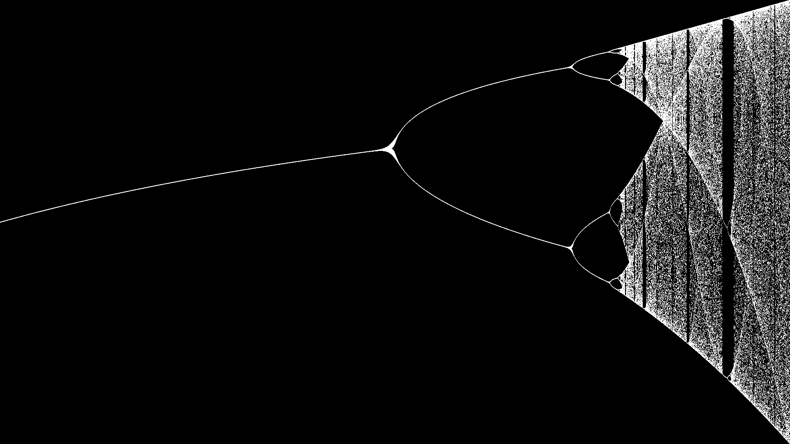

# Nasal Namespace



## Introduction

In this nasal interpreter,
we use this way below to construct namespaces:

- library is linked directly with the script
- module is wraped by a function generated by linker, and return a hash

## Library

Library file is linked with script file directly, like this:

In `std/lib.nas`:

```nasal
var a = 1;
```

In `example.nas`:

```nasal
var b = 1;
```

At the link stage,
in fact we put the ast of two files together to make a new ast,
so the result is equal to:

```nasal
var a = 1;
var b = 1;
```

## Module

Modules is wraped up by a function,
and return a hash, for example:

In `std/example_module.nas`:

```nasal
var a = 1;
```

We analysed this file and generated the ast.
Then we find all the global symbols.
At last we use the information of all the globals symbols in this file to generate a hash to return.

So the result is equal to:

```nasal
var example_module = func {
    # source code begin
    var a = 1;
    # source code end
    return {
        a: a
    };
}();
```

## Import a module

Here is a module named `std/example_module.nas`:

```nasal
var a = 1;
```

Then there's a script file named `test.nas`, import module in this file using this way:

```nasal
use std.example_module;

println(example_module.a); # 1
```

Or this way:

```nasal
import("std/example_module.nas");

println(example_module.a); # 1
```
